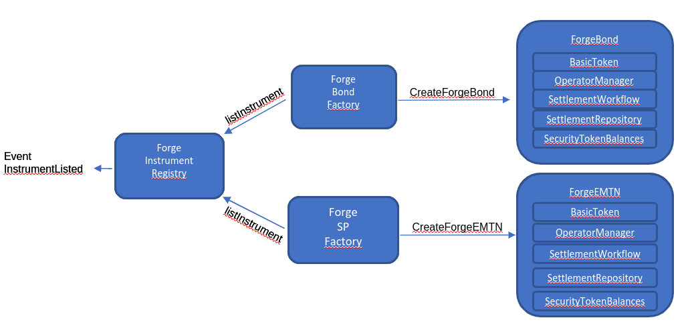

ForgeTokenFactory deployment on Infura:
npm run init -- --network-folder ../../../../networks/testnet/

You can access to the ForgeTokenFactory address at the contract address
field identified at the end of the deployment

# Diagram



# Developing Smart Contracts

## Adding a Function

1. Add the function to the solidity file.

```
function getType() public view override returns (string memory) {
    return "Bond";
}
```

2. Add the field to the TypeScript interface in `cast-interface-v1`. This file is shared with other blockchains, such as Tezos.

```typescript
public async getType(
transactionBlockchainSpecificParams?: Partial<
    BlockchainSpecificParamsOf<Driver>
>,
): Promise<CallResult<string>> {
return this._call('getType', [], transactionBlockchainSpecificParams);
}
```

3. Deploy the changes. If the environment is already running, run the command `make redeploy-eth`. Otherwise, run the command `make start`.

## Adding a Field

1. Add the field to the solidity file.

```
constructor(BasicTokenLibrary.BasicTokenInput memory basicTokenInput)
    public
{
    token.isinCode = basicTokenInput.isinCode;
}
```

2. Add the field to the TypeScript interface in `cast-interface-v1`. This file is shared with other blockchains, such as Tezos.

```typescript
isinCode: async (storage: ForgeTokenStorage, methodParameters: unknown[]) =>
storage.isinCode,
```

3. Deploy the changes. If the environment is already running, run the command `make redeploy-eth`. Otherwise, run the command `make start`.

## Adding a Constant

1. Add the constant to the Smart Contract (`.sol` file):

```
uint256 public constant REGISTRAR_ROLE = 0x01;
```

2. Add the constant to the `viewMapper.ts` file in `cast-interface-v1`. This file is shared with other blockchains, such as Tezos.

```
export const REGISTRAR_ROLE = 1;
```

3. Deploy the changes. If the environment is already running, run the command `make redeploy-eth`. Otherwise, run the command `make start`.

# Scripts

- `extract:abi` : places the ABI of each contract/lib in `abi/*.json`
- `extract:last-deploy` : generates `./last-deploy.json` which contains the last known address on the network of ID 5777 for each truffle artifact 
- `deploy` : deploys all artifacts according to migration script using forgeNet when running inside the forge kube cluster (no cache migration)
- `deploy:forgeNet` : this command deploy all artifacts according to migration script using forgeNet passing by the internet (no cache migration)
- `compile:contracts`: compile solidity to artifacts, derived typescript type from them
- `compile:ts` : compile migration and tools

# Notes

- The version of the `prettier-plugin-solidity` dependency in has to match that of the latest version of the `juanblanco.solidity` extension so that auto-formatting in IDE does not lead to errors when running `npm run lint`

# License

Apache 2.0

